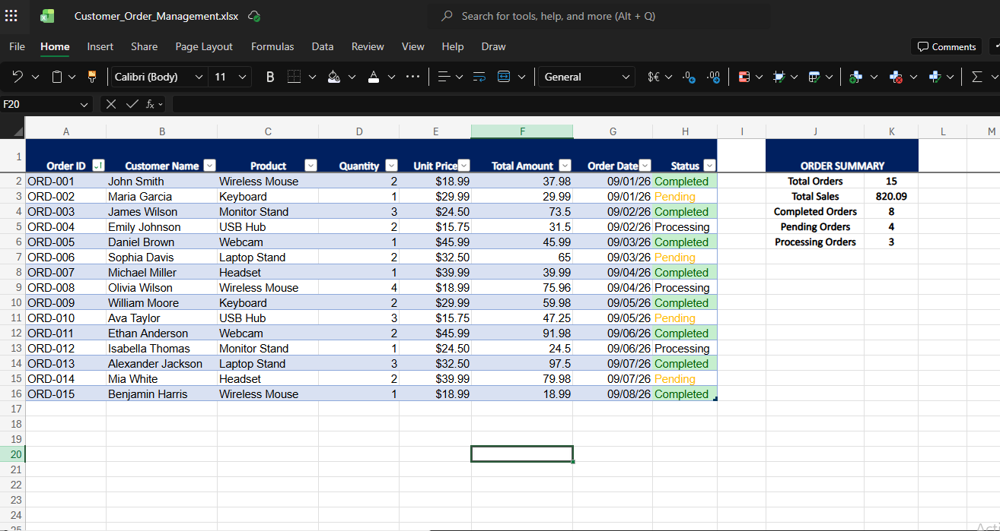
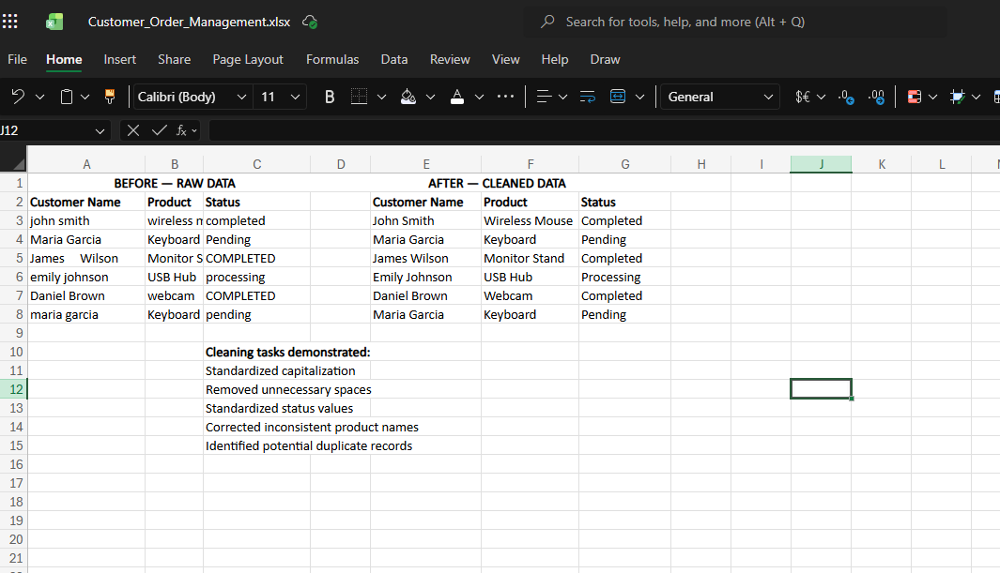

# data-entry-excel-portfolio

# 📊 Data Entry & Excel Portfolio

## Customer Order Management Spreadsheet

**Self-initiated portfolio project**

This project demonstrates my ability to enter, organize, clean, and manage business data using Microsoft Excel.

The spreadsheet simulates a customer order management workflow that a small business could use to track orders, sales, and order status.

---

## 🎯 Project Objective

Create a clean and organized spreadsheet for managing customer orders while demonstrating practical Excel skills used in administrative and data-entry work.

---

## 🛠️ Skills Demonstrated

* Data Entry
* Data Cleaning
* Spreadsheet Formatting
* Excel Formulas
* Data Validation
* Sorting & Filtering
* Data Organization
* Quality Control
* Basic Business Reporting

---

## 📋 Spreadsheet Features

### Order Management

The workbook contains:

* Order IDs
* Customer names
* Products
* Quantities
* Unit prices
* Total order amounts
* Order dates
* Order status

### Automated Calculations

The Total Amount column uses Excel formulas to automatically calculate:

**Quantity × Unit Price**

This allows totals to update automatically when order quantities or prices change.

### Data Validation

The Status column uses a dropdown containing:

* Completed
* Pending
* Processing

This helps maintain consistent data entry.

### Order Summary

The workbook includes an automated summary showing:

* Total Orders
* Total Sales
* Completed Orders
* Pending Orders
* Processing Orders

### Data Cleaning Example

A separate worksheet demonstrates the process of cleaning inconsistent raw data.

Examples include:

* Standardizing capitalization
* Removing unnecessary spaces
* Standardizing status values
* Correcting inconsistent product names
* Identifying potential duplicate records

---

## 📁 Files

**Customer_Order_Management.xlsx**

Contains the complete Excel workbook with the order management dataset, formulas, summary, validation, and data-cleaning example.

---

## 🔍 Quality Control

The spreadsheet was checked for:

* Consistent formatting
* Formula accuracy
* Data consistency
* Proper date formatting
* Correct currency formatting
* Functional filters
* Functional status dropdowns
* Accurate summary calculations

---

## 💻 Tools Used

**Microsoft Excel**

## 📸 Project Preview

### Customer_Order_Management.xlsx

### Data Cleaning

### Excel Features

---

## 📌 Project Type

**Self-initiated portfolio project created to demonstrate data-entry, spreadsheet management, and administrative support skills.**

No client information or confidential data was used.

---

## 👤 About Me

I'm building my freelance career as a Virtual Assistant and providing support in:

**Data Entry • Virtual Assistance • Web Research • Administrative Support • Document Formatting**

I'm focused on accurate work, organized processes, clear communication, and reliable delivery.
